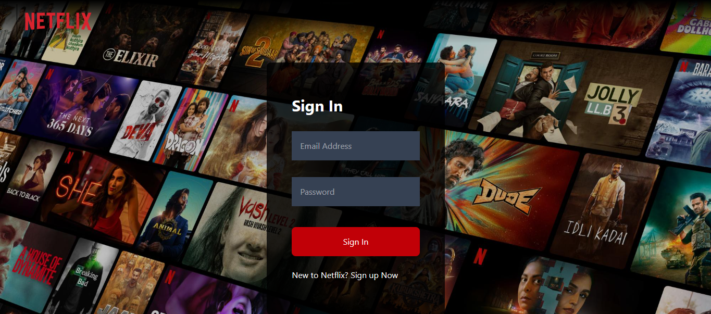
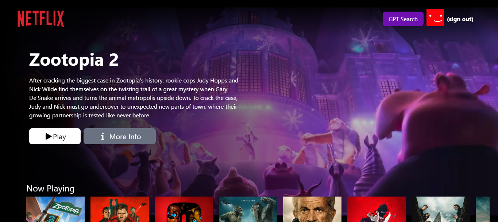
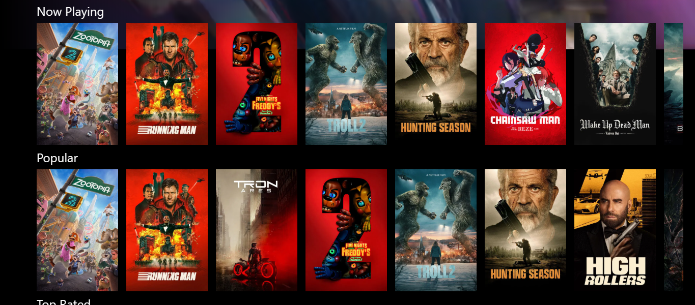
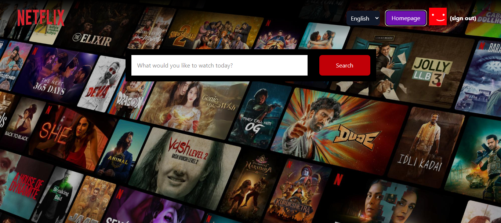
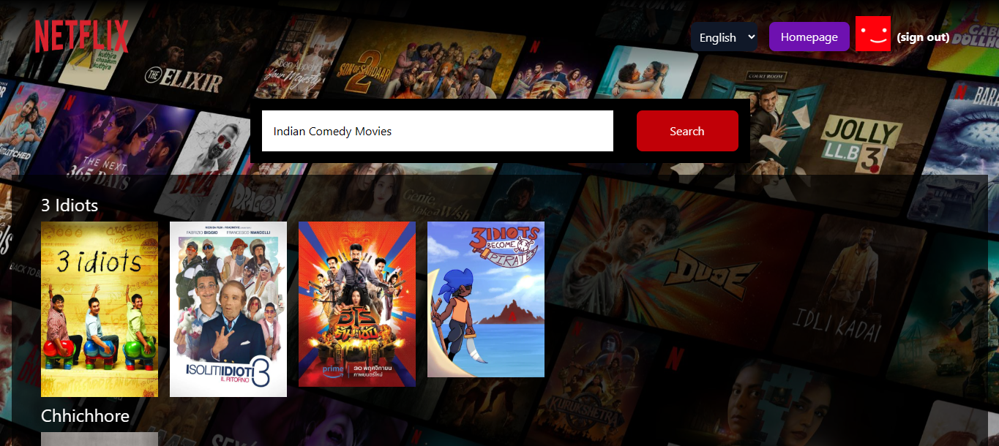

# 🎬 Netflix GPT - AI-Powered Movie Recommendation Platform

A modern Netflix-inspired web application with AI-powered movie recommendations built using React, Redux, Firebase, and Groq AI.

## 🚀 Live Demo

**[View Live Project](https://netflixgpt-54e66.web.app/)**

- Login Page



- Browse



- Categories



- GPT Page



- GPT Search Results



## ✨ Features

### 🔐 Authentication

- User Sign Up / Sign In with Firebase Authentication
- Form validation with custom validation logic
- Profile management with display name and avatar
- Protected routes with automatic redirection
- Secure logout functionality

### 🎥 Browse Movies

- **Hero Section**: Featured movie with auto-playing trailer background
- **Multiple Movie Categories**:
  - Now Playing
  - Popular Movies
  - Top Rated
  - Upcoming Movies
- Smooth horizontal scrolling movie lists
- High-quality movie posters from TMDB
- Responsive movie cards

### 🤖 GPT-Powered Movie Search

- AI-powered movie recommendations using Groq AI
- Natural language search queries
- Intelligent movie suggestions based on user input
- Results fetched from TMDB API

### 🎨 UI/UX Features

- Netflix-inspired dark theme design
- Fully responsive for mobile, tablet, and desktop
- Smooth animations and transitions
- Professional shimmer loading effects:
  - Hero section shimmer
  - Movie row shimmer
  - Video loading shimmer
  - GPT search results shimmer
- Custom scrollbar styling

## 🛠️ Tech Stack

### Frontend

- **React 19.2.0** - UI library
- **Redux Toolkit** - State management
- **React Router DOM** - Client-side routing
- **Vite** - Build tool and dev server
- **Tailwind CSS 4.1.17** - Styling framework

### Backend & Services

- **Firebase** - Authentication & Hosting
- **Groq AI (GPT-based)** - AI movie recommendations
- **TMDB API** - Movie data and images

### Additional Tools

- **ESLint** - Code linting
- **React Hooks** - Custom hooks for data fetching

## 📦 Project Structure

```
netflix-gpt/
├── src/
│   ├── components/
│   │   ├── Auth/
│   │   │   ├── Body.jsx          # Main routing component
│   │   │   └── Login.jsx         # Login/SignUp page
│   │   ├── Browse/
│   │   │   ├── Browse.jsx        # Main browse page
│   │   │   ├── MainContainer.jsx # Hero section with video
│   │   │   ├── SecondaryContainer.jsx # Movie lists section
│   │   │   ├── VideoBackground.jsx    # YouTube video player
│   │   │   ├── VideoTitle.jsx    # Video title overlay
│   │   │   ├── MovieList.jsx     # Horizontal movie list
│   │   │   └── MovieCard.jsx     # Individual movie card
│   │   ├── GPT/
│   │   │   ├── GptSearch.jsx           # GPT search page
│   │   │   ├── GptSearchBar.jsx        # Search input with AI
│   │   │   └── GptMovieSuggestions.jsx # AI search results
│   │   └── Common/
│   │       ├── Header.jsx        # Navigation header
│   │       └── Shimmer.jsx       # Loading shimmer effects
│   ├── hooks/
│   │   ├── useNowPlayingMovies.jsx
│   │   ├── usePopularMovies.jsx
│   │   ├── useTopRatedMovies.jsx
│   │   ├── useUpcomingMovies.jsx
│   │   └── useMovieTrailer.jsx
│   ├── redux/
│   │   ├── appStore.jsx          # Redux store configuration
│   │   ├── userSlice.jsx         # User authentication state
│   │   ├── moviesSlice.jsx       # Movies data state
│   │   ├── gptSlice.jsx          # GPT search state
│   │   └── configSlice.jsx       # App config (language, etc)
│   ├── config/
│   │   ├── firebase.jsx          # Firebase configuration
│   │   ├── openai.jsx            # Groq AI configuration
│   │   ├── constants.jsx         # App constants & API keys
│   │   ├── languageConstants.jsx # Multi-language strings
│   │   └── validate.jsx          # Form validation logic
│   ├── assets/                   # Static assets
│   ├── App.jsx                   # Root component
│   ├── App.css                   # App styles
│   ├── main.jsx                  # Entry point
│   └── index.css                 # Global styles
├── public/
├── build/                        # Production build
├── index.html
├── package.json
├── vite.config.js
├── eslint.config.js
├── tailwind.config.js
└── firebase.json
```

## 🚀 Getting Started

### Prerequisites

- Node.js (v16 or higher)
- npm or yarn
- Firebase account
- TMDB API key
- Groq AI API key

### Installation

1. **Clone the repository**

   ```bash
   git clone https://github.com/raj-jondhale/NetflixGpt
   cd netflix-gpt
   ```

2. **Install dependencies**

   ```bash
   npm install
   ```

3. **Set up environment variables**
   Create a `.env` file in the root directory:

   ```env
   VITE_FIREBASE_KEY=your_firebase_api_key
   VITE_TMDB_KEY=your_tmdb_api_key
   VITE_OPENAI_KEY=your_groq_api_key
   ```

4. **Run the development server**

   ```bash
   npm run dev
   ```

5. **Build for production**

   ```bash
   npm run build
   ```

6. **Deploy to Firebase**
   ```bash
   firebase deploy
   ```

## 🔑 API Keys Setup

### TMDB API

1. Go to [TMDB](https://www.themoviedb.org/)
2. Create an account and get your API key
3. Add to `.env` as `VITE_TMDB_KEY`

### Groq AI

1. Visit [Groq AI](https://groq.com/)
2. Sign up and generate an API key
3. Add to `.env` as `VITE_OPENAI_KEY`

### Firebase

1. Create a project at [Firebase Console](https://console.firebase.google.com/)
2. Enable Authentication (Email/Password)
3. Get your Firebase config
4. Add Firebase API key to `.env` as `VITE_FIREBASE_KEY`

## 🎯 Key Features Implementation

### Custom Hooks

- `useNowPlayingMovies` - Fetch currently playing movies
- `usePopularMovies` - Fetch popular movies
- `useTopRatedMovies` - Fetch top-rated movies
- `useUpcomingMovies` - Fetch upcoming movies
- `useMovieTrailer` - Fetch YouTube trailer for specific movie

### Redux State Management

- **userSlice**: User authentication state
- **moviesSlice**: Movie data from TMDB
- **gptSlice**: GPT search results and loading state
- **configSlice**: App configuration (language, theme)

## 📱 Responsive Design

- Mobile-first approach
- Breakpoints for tablet and desktop
- Touch-friendly UI elements
- Optimized images for different screen sizes

## 🔒 Security Features

- Protected routes
- Firebase authentication
- Environment variables for sensitive data
- Form validation and sanitization

## 🌐 Multi-Language Support

- English
- Hindi
- Marathi
- Easy to add more languages

## 📈 Future Enhancements

- [ ] Movie ratings and reviews
- [ ] Advanced filters and sorting
- [ ] User preferences and recommendations
- [ ] Trailer autoplay controls
- [ ] Dark/Light theme toggle

## 🤝 Contributing

Contributions are welcome! Please feel free to submit a Pull Request.

## 👨‍💻 Developer

**Rajesh Jondhale**

## 🙏 Acknowledgments

- [TMDB](https://www.themoviedb.org/) for movie data
- [Firebase](https://firebase.google.com/) for authentication and hosting
- [Groq AI](https://groq.com/) for AI-powered recommendations
- Netflix for design inspiration

---

⭐ Star this repository if you find it helpful!
